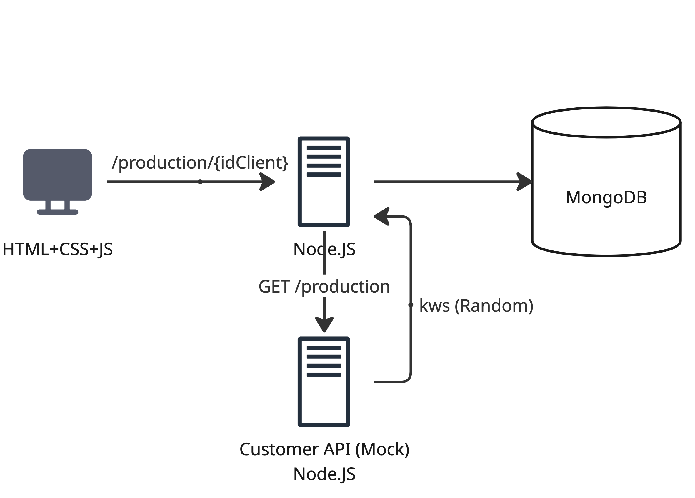

# Implementation of Renewable Energy Production Monitoring
This functionality should only be accessible to users associated with the 'Operations Manager' role.
Customer data must be read from a Mock API that provides random numbers representative of the readings.

# Accounting for Energy Credits
This functionality should only be accessible to users associated with the 'Operations Manager' role.

## System Architecture

The system architecture consists of the following components and interactions:

1.  **Frontend (React, Material-UI):** The client-side application initiates a request to the backend. Specifically, it sends a request to the `/production/{idClient}` endpoint.
2.  **Main Backend (Node.JS Server):**
    *   Receives the `/production/{idClient}` request from the frontend.
    *   Interacts with a **MongoDB** database for data storage and retrieval.
    *   Makes a `GET /production` request to a mock Customer API to fetch energy production data.
3.  **Customer API (Mock Node.JS Server):**
    *   This is a separate mock service.
    *   It receives the `GET /production` request from the main Node.JS server.
    *   It responds with random kilowatt values (kws (Random)) to simulate energy readings from a customer's system.
    *   The main Node.JS server receives these random kilowatt values from the Customer API.

 